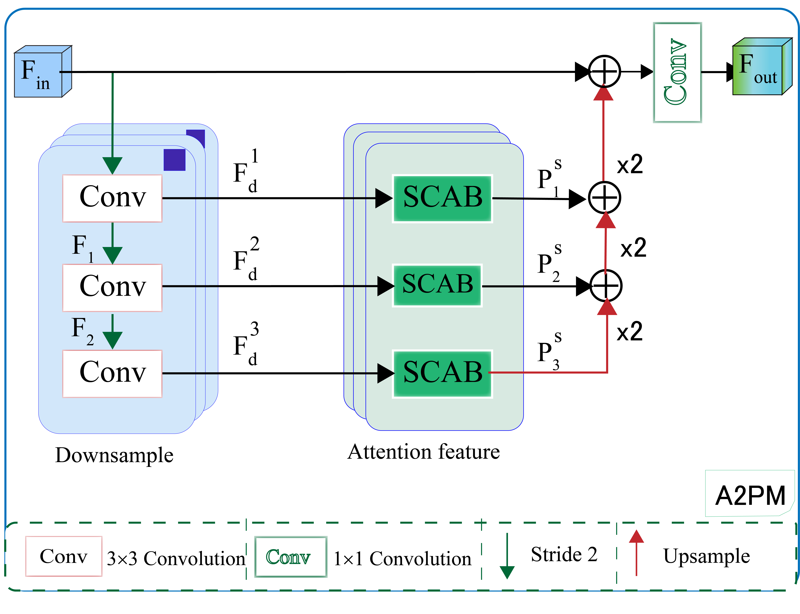
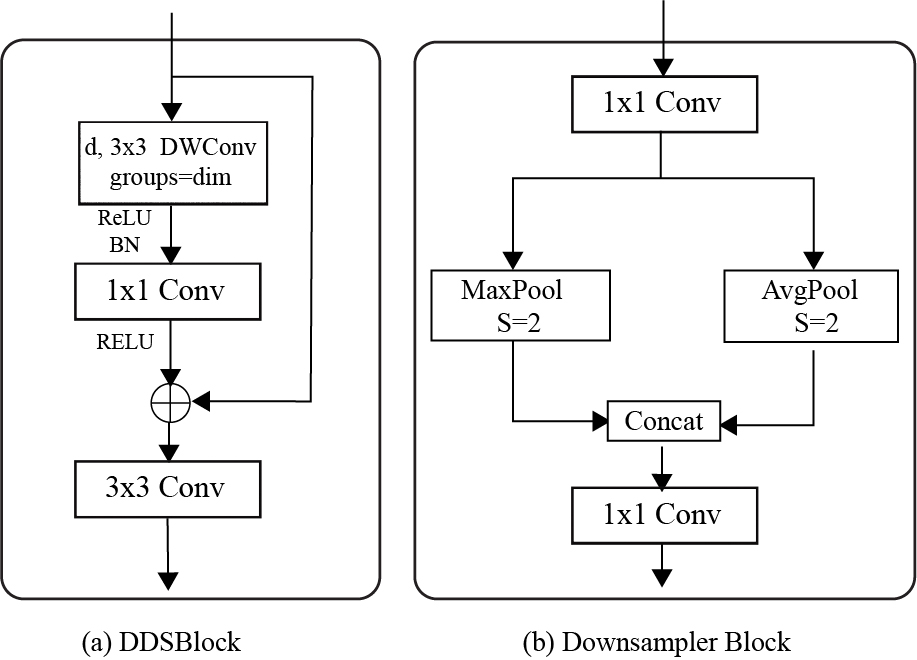

# A2PNet: Real-time Medical Image Segmentation via Attentive Atrous Pyramid Network

[](https://www.python.org/downloads/)
[](https://pytorch.org/)
[](LICENSE)

> Official PyTorch implementation of "Real-time Medical Image Segmentation via Attentive Atrous Pyramid Network" accepted at Engineering Applications of Artificial Intelligence (September 2025).

## 🚀 Overview

A2PNet is a novel deep learning architecture designed for real-time medical image segmentation. The network leverages an Attentive Atrous Pyramid Module (A2PM) to capture multi-scale contextual information while maintaining computational efficiency for real-time applications.

### Key Features

- ⚡ **Real-time Performance**: Optimized for fast inference on medical images
- 🎯 **Multi-scale Context**: Attentive Atrous Pyramid Module captures features at different scales
- 🏥 **Medical Domain**: Specifically designed for medical image segmentation tasks
- 📊 **State-of-the-art Results**: Competitive performance on multiple medical datasets

## 🏗️ Architecture

### Network Overview


### Module Details

| Attentive Atrous Pyramid Module (A2PM) | Dense Dilated Spatial Block (DDS) |
| :------------------------------------: | :-------------------------------: |
|  |  |
## 📋 Requirementszzz

```bash
Python >= 3.8
PyTorch >= 1.9.0
torchvision >= 0.10.0
opencv-python >= 4.5.0
numpy >= 1.21.0
albumentations >= 1.0.0
```

## 🛠️ Installation

1. **Clone the repository**
```bash
git clone https://github.com/yourusername/A2PNet.git
cd A2PNet
```

2. **Create a virtual environment**
```bash
python -m venv venv
source venv/bin/activate  # On Windows: venv\Scripts\activate
```

3. **Install dependencies**
```bash
pip install -r requirements.txt
```

## 📊 Datasets

### Supported Datasets

| Dataset | Task | Download |
|---------|------|----------|
| **Retinal Vessel** | Vessel Segmentation | [Mendeley Data](https://data.mendeley.com/datasets/frv89hjgrr/1) |
| **BUSI** | Breast Ultrasound | [Kaggle](https://www.kaggle.com/datasets/aryashah2k/breast-ultrasound-images-dataset) |
| **Lung CT** | Lung Segmentation |  [Kaggle](https://www.kaggle.com/datasets/piyushsamant11/pidata-new-names) |

### Dataset Structure

Organize your datasets in the following structure:

```

    └── A2PNet
        ├── data
            ├── LungCT
                ├── 2d_images
                |   ├── ID_0000_Z_0142.tif
                │   ├── ID_0001_Z_0146.tif
                │   ├── ...
                |
                └── masks
                    |   ├── ID_0000_Z_0142.tif
                    |   ├── ID_0001_Z_0146.tif
                    |   ├── ...
            ├── busi
                ├── images
                |   ├── benign (1).png
                │   ├── malignant (1).png
                │   ├── ...
                |
                └── masks
                    |   ├── benign (1).png
                    |   ├── malignant (1).png
                    |   ├── ...
            ├── RetinalBV
                ├── CHASEDB1
                ├── DRIVE
                └── STARE
        ├── datasets
        ├── models
        ├── utils
        ├── trainer.py
        ├── train.py
        └── test.py